# IKBC F108 改造键线分离，增加U2U

2016 年底买的 IKBC F108 时光机键盘，后来便在公司使用。公司搬过几次家，键盘就不太方便携带，最终一直在柜子里吃灰。

最近整理键盘文章时候，发现有键线分离这种东西。就是你的键盘原本和数据线是长在一起的话，可以拆开键盘，把原有数据线拆除，换成一个一个模块（一般是
Type-C 接口），这样键盘就带有接口了，你就可以随便给更换数据线了。这就是键盘和数据线的分离。

```
提示：
键线分离主要方便于更换数据线。
常见于拥有多个键盘，便于切换，或键盘经常进行拆机维修，再或者经常需要移动等场景。
如果只有一把键盘，且本身对客制化要求不高，不建议进行改造键线分离。
```

## IKBC F108 键盘拆解


有些脏兮兮的 IKBC F108

我之前看到介绍 IKBC F87 键盘是可以改装的，而且是可以做到无损改装。那周周末就把 IKBC F108 带回家了，拆开看看。

外壳是上下两侧多个卡扣扣住，非常的紧实。

拆开看看 IKBC F108 的正面，非常的脏。因为从来没有拆开过，所以内部的头发丝等比较多。拔下键帽后，后续会认真的清理。

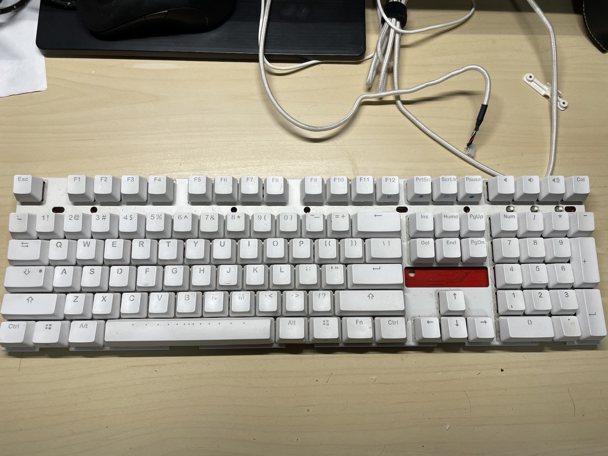

IKBC F108 正面比较脏，从未拆开清理过。

再来看看内部线缆情况。

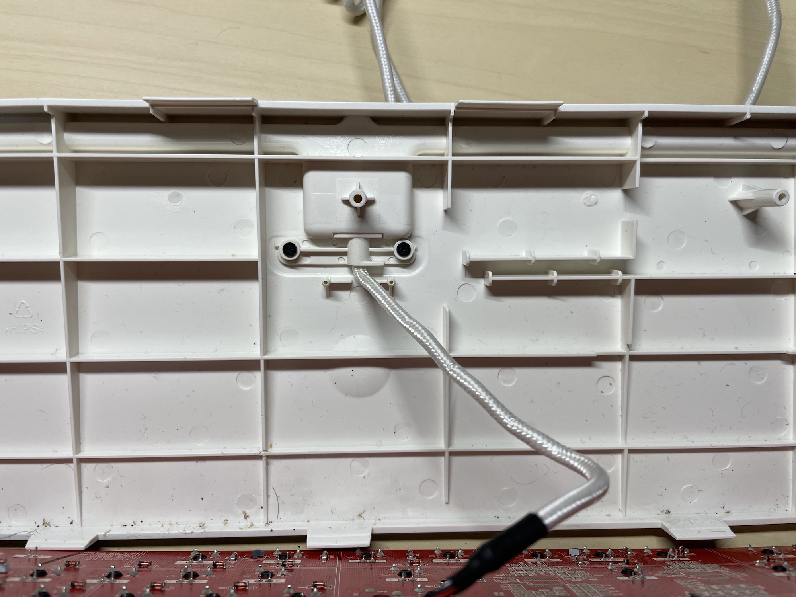

IKBC F108 背板走线

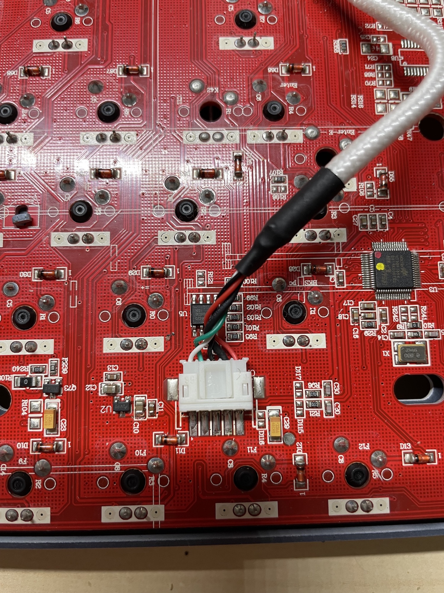

IKBC F108 主板走线

可以看到，原线缆直接通过键盘背板开孔，走到了主板上。主板是使用了 PH2.0 5Pin 接口。

## IKBC F108 键线分离及增加 U2U 无损改造

```
请看完全文，在进行着手改造。有部分细节内容相对偏后。
```

如果你也是这种一根数据线，内部直接连接主板的情况，就可以改造为键线分离。你需要购买只有一个 —— USB Type-C 转接板。

如果没有成熟的方案，你可能还需要：锉刀微改键盘结构、电烙铁焊锡等焊接工具、尺子测量工具、端子线连接键盘等。

USB Type-C 转接板需要直接暴露到键盘外部接口处。如果你的键盘线缆口太小，需要锉刀等工具，进行扩大。我的键盘在淘宝有合适的键线分离板，而且还附送键盘尾部的外壳，正好覆盖背板开槽。就是贵一点，25块，附送并焊接好一根
PH 2.0 数据线。有一家店铺内容和它一样，还便宜不到 10 块钱。但是客服发给我一张尺寸图，明显安装不上的那种。所以我就买贵的这家了。

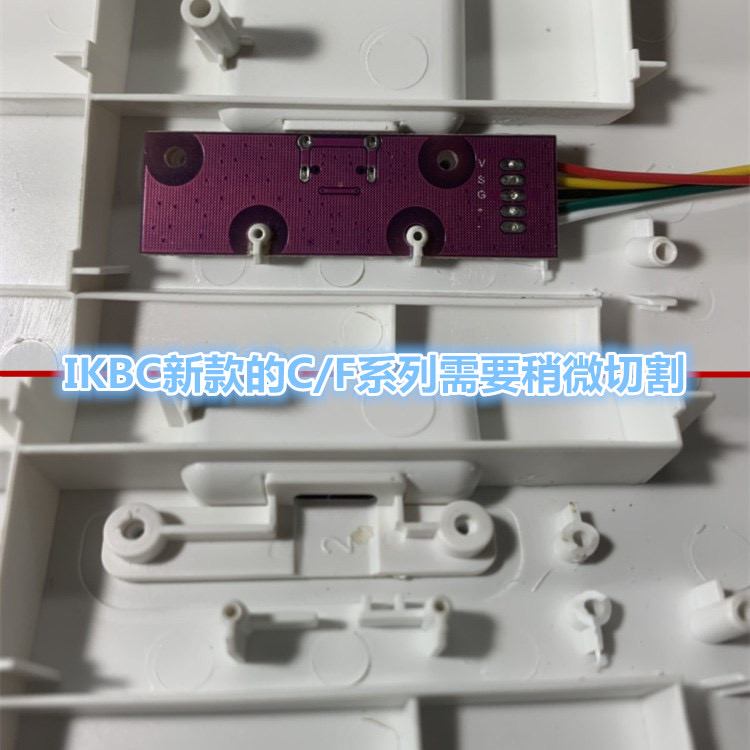

收到时候忘记拍照了，这个是店家图片。

如果你找不到合适的板子，那么可以买通用版本。下面图片这种，大概不到 5 毛钱一个。

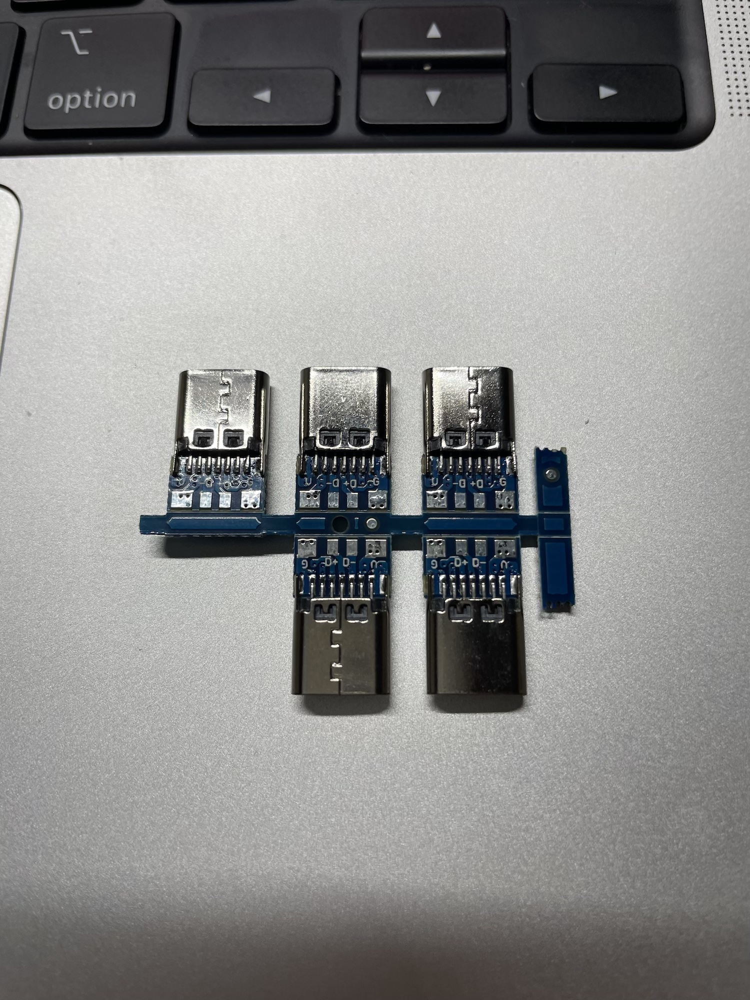

### 转接板 `CC` 线

**这里出现第一个大坑。**选择这个 Type-C 转接板时候，要注意它的焊点。常见几乎都是四个焊点，即 `V 电源 5V` `GND 接地` `D+`
数据 `D-` 数据。这会影响数据线使用。

我买的版本就没有所谓 `CC` 线焊点。如果你想用 C2C 的数据线，键盘直连电脑，那么需要有 `CC` 焊点，在 `CC` 焊点到 `GND` 之间增加一个
5.1K 电阻即可。如果不增加这个的话，只能使用 A2C 的数据线。或者你用 C2C 数据线，在电脑那端，再增加一个 Type-C 转接 USB-A 的插头。

我的就是额外增加一个转接头，如下：

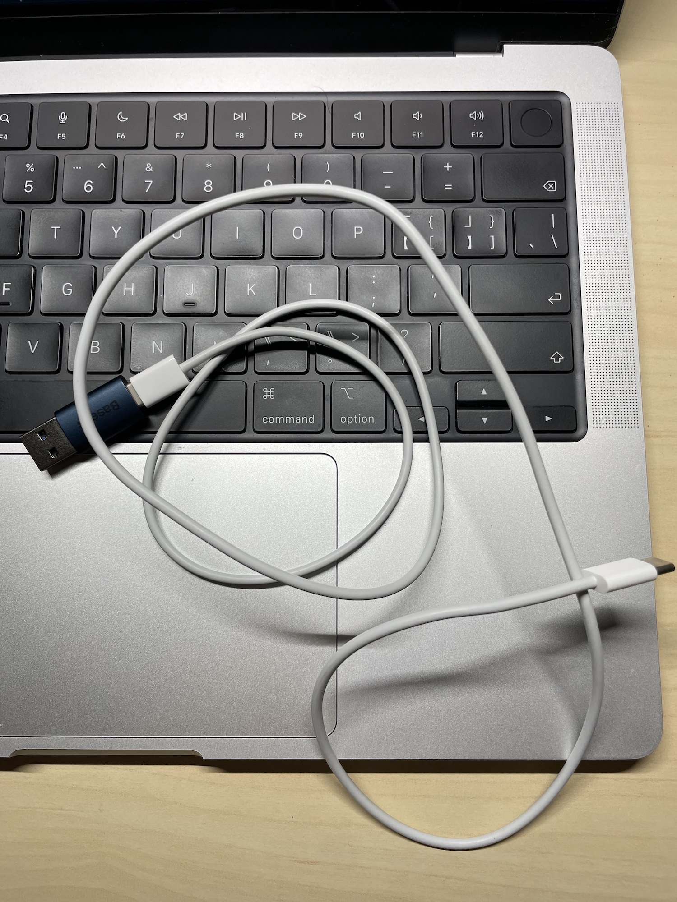

使用 USB 转接头的 Type-C 数据线

虽然网上卖的板子几乎都没有 `CC` 焊点，但是据说通用的版本，背面有个焊点是 `CC`，是可以实现的。由于我手里没有 Type-C
母口及测试板，我就没有尝试过。

便宜的通用版，是不带键盘那边的插头和线的。所以如果键盘是类似我图片的那种接口，也要买好数据线。

### 选对端子线头

**这里开始第二个坑。**不是所有键盘端子线都是 PH 2.0。这里有 GH 1.25，ZH 1.5，PH 2.0，XH 2.54
几个规格。这个数字表示两根针孔之间的距离毫米数。这个建议用尺子量一下，比如我的 5Pin 接线端子，总宽度
11mm，除去两边的边稍微厚一点，中间间距大概是 2.0mm。

### 额外选配 U2U

我顺便还购入了一款 EasyLink U2U 模块。让键盘可以支持 VIAL。如果只做键线分离，这个不用买。

买的时候让店家帮忙拆掉 USB 口。但是店家只能拆掉连接键盘的 USB
母口，连接电脑的 USB A 口拆不掉。我自己也尝试了，确实如此，主要是板子太小，怕伤到周围元器件。

结果收到后，我发现手里没有 USB 母口，只能暴力拆了一个充电头，用于临时走飞线测试。

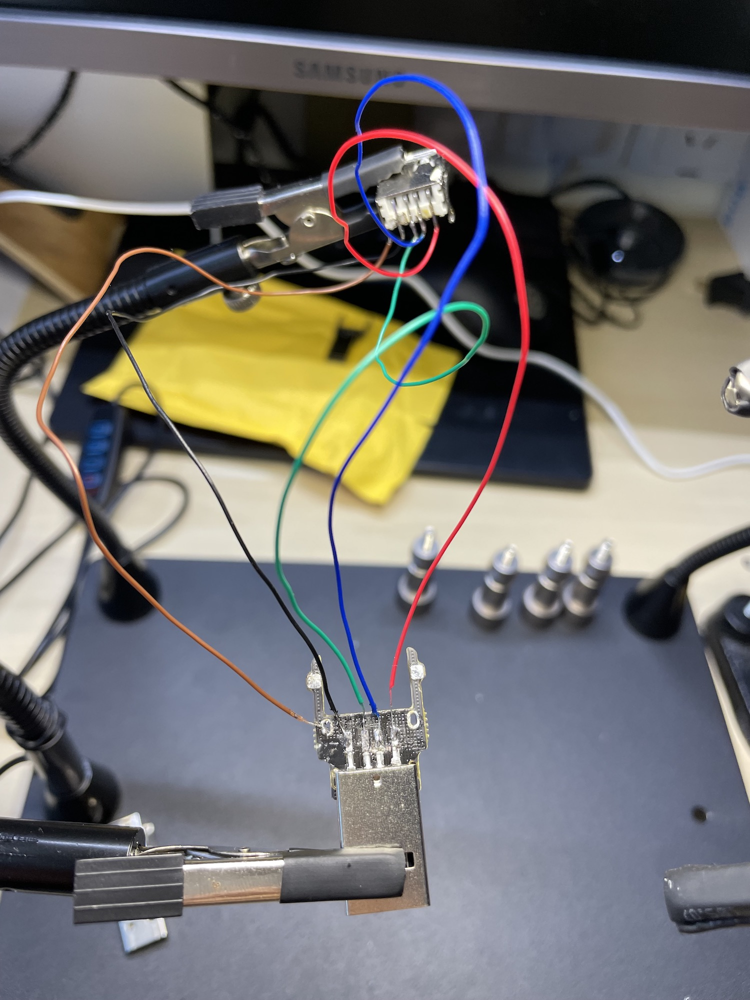

EasyLink U2U 临时焊接 USB 母口，测试质量。

把 USB 母口和 EasyLink U2U 连接，测试其质量。因为是店家人工拆除的母口，怕出故障，一定要先测试下。

### 调整线序

**接下来会遇到第三个坑。**如果你购买的端子线和键盘默认的顺序不同，那么需要自己改顺序。

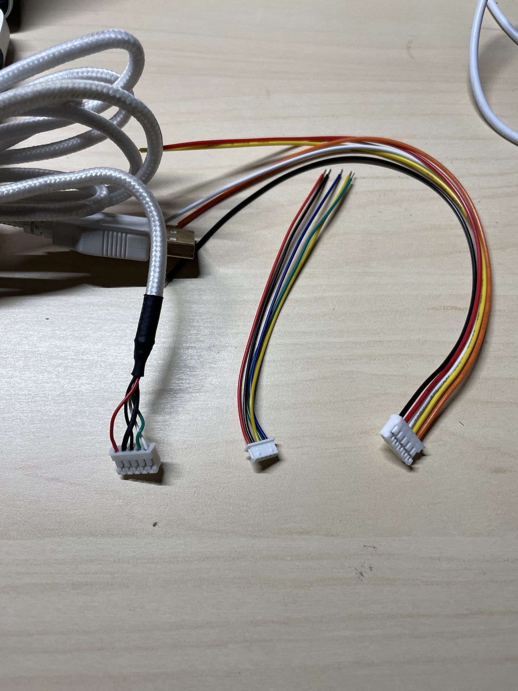

一般规则是：V 电源-红色；GND 接地-黑色；D+ 数据-绿色；D- 数据-白色；外壳-黄色。

不同键盘，颜色顺序不同，这个绝对不能错。

如果你的线缆颜色不标准，建议对照下图 USB 顺序，用万用表测量下。

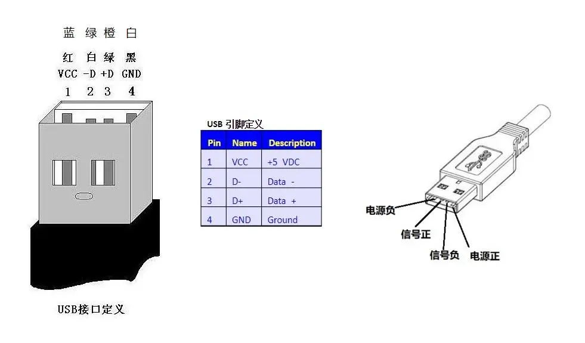

图片来源：https://www.jianshu.com/p/33498c6e865a

我的键盘端子顺序就是：红、黄（实际为粗黑）、黑、绿、白。

买回来的顺序不太一样，稍微调整下。用镊子插进去，把白色卡扣轻微翘起来，线缆就可以拽出来了。具体操作，可以网络上搜索图片和视频学习。

这一步完成后，就开始正式焊接了。

### 开始焊接

如果你只想改键线分离，那么顺序是：电脑通过数据线，连接到键线分离板的 Type-C 口，之后 Type-C 口转换到板载焊点，焊点通过数据线通过接线端子或者直接焊接到键盘。

我因为增加了 U2U，所以在中间增加了它。

焊接也是，请自行学习，我不介绍了。

我自己在中间增加了一个 U2U 模块，焊接它比较麻烦，结果还是焊坏了一个。

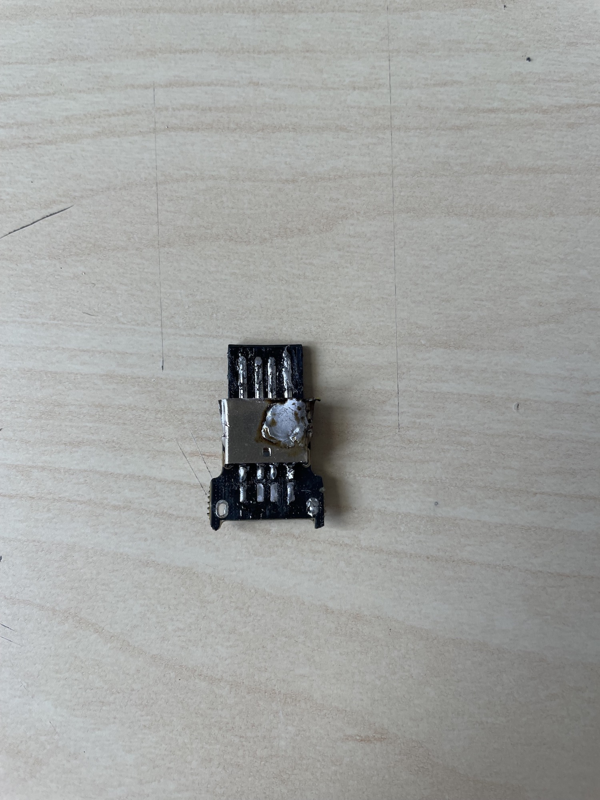

暴力焊接后，故障的 U2U。

**这里算是第四个坑。**即如果手艺不太好，焊接部分比较多的话，建议选择成品键线分离（只需要组装，不用焊接），或者多购买一点材料备用。

**如果焊接不好，建议付费找专业人员代劳，比如手机维修店、电器维修店等。**

焊接时候是五根线，可能对应四个焊点。**这里要不要算第五个坑呢。**就是黄色屏蔽线，一般可以接入 `GND` ，或者想办法焊接到 USB
金属外壳上。也可以像我一样，干脆不接了。

本来我是想焊接在 U2U 外壳上的，但是焊接发现需要长时间高温，使得 U2U 芯片比较危险。而且我黄色线没有预留太长，够不到屏蔽壳，干脆就放弃了。

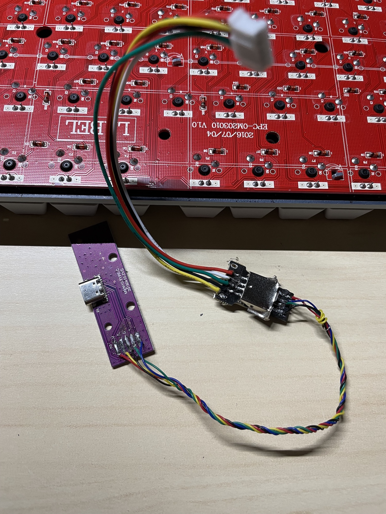

焊接后效果

焊接完成的效果，如果不接 U2U，那么键线分离板直接焊接端子线，插到键盘主板上。

或者不用端子线，直接焊接到主板上。除非你的键盘主板不带有端子线，否则不推荐这么做，未来维修之类不方便。

### 焊接后测试

**焊接完成后，务必接上键盘进行测试。**以免最后都安装好了，发现有问题。

不用安装螺丝等，直接接入电脑测试下效果，没问题再组装。

### 组装改装后的键盘

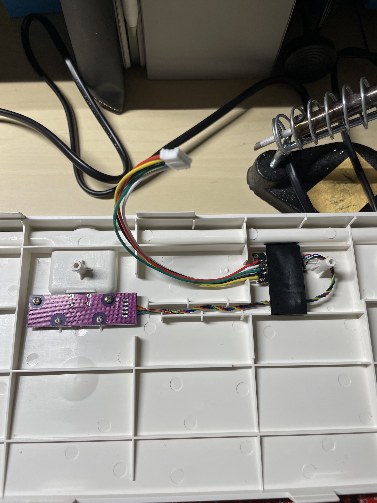

后壳安装键线分离板及 U2U

最后，把这些都安装在后壳上。如果你的是通用键线分离，可能要使用塑料胶棒进行粘贴。

为了防止电线乱跑，我用电工绝缘胶带粘贴了下。防止金属外壳接触到键盘背部接线。如果不加装 U2U，可以使用其他胶带固定，或者干脆不用固定。

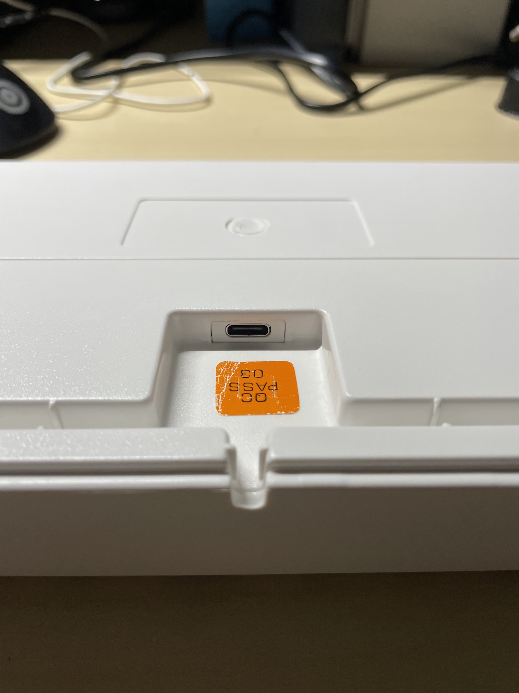

IKBC F108 键线分离接口

由于买的配套套件，所以接口处尺寸特别合适。实现了无损改键线分离。

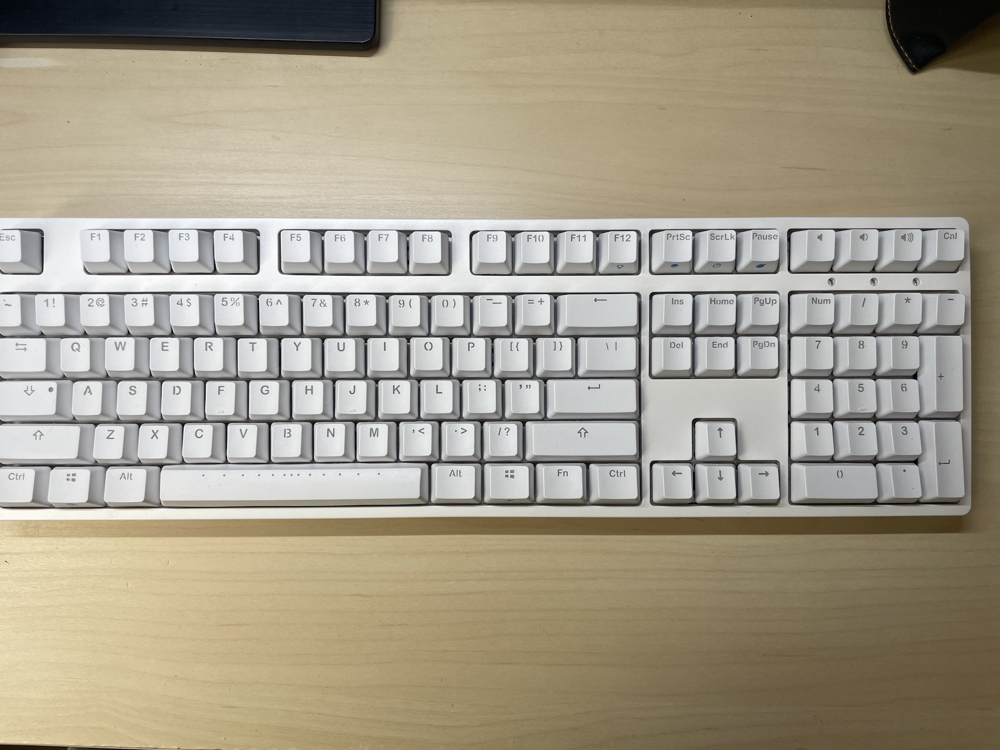

## 最后

IKBC F108 在 2016 年入手，刚上手时候竟然觉得它还不如自己客制化的 GH60。当时也在惋惜：

```
这个键盘不支持层编程，或者录制宏。层编程就算奢望，这种功能主要在 60 键盘上提供，104 键盘提供的太少了。
但是如果想做定制可玩的键盘，还是建议他们后续延续 Poker 的录制宏能力。
```

没想到今天，终于自己帮它实现了！

不过也可惜的是，IKBC F108 加装 EasyLink U2U 后，最右侧上面四个按键（音量开关、音量加、音量减、计算器）就失效了。

这个应该是 U2U 自身问题。但是在改装后才发现，前期确实是自己疏忽了。

之前使用 U2U 对一把薄膜键盘进行了全量测试，所有按键及特殊功能键均可以识别并改键，以为所有键盘都可以了。没想到 IKBC F108
这四个按键键值不太常规，识别不了。

这算是完美中的瑕疵。

最后的最后，IKBC F108 为什么不直接改无线键盘。主要原因是键盘内部空间不够，难以放下电池。而且我所了解到的蓝牙板，没有开关，全靠是否插上外置电源。故安装开关，要在键盘壳体开孔，做不了无损改装，就放弃了。

