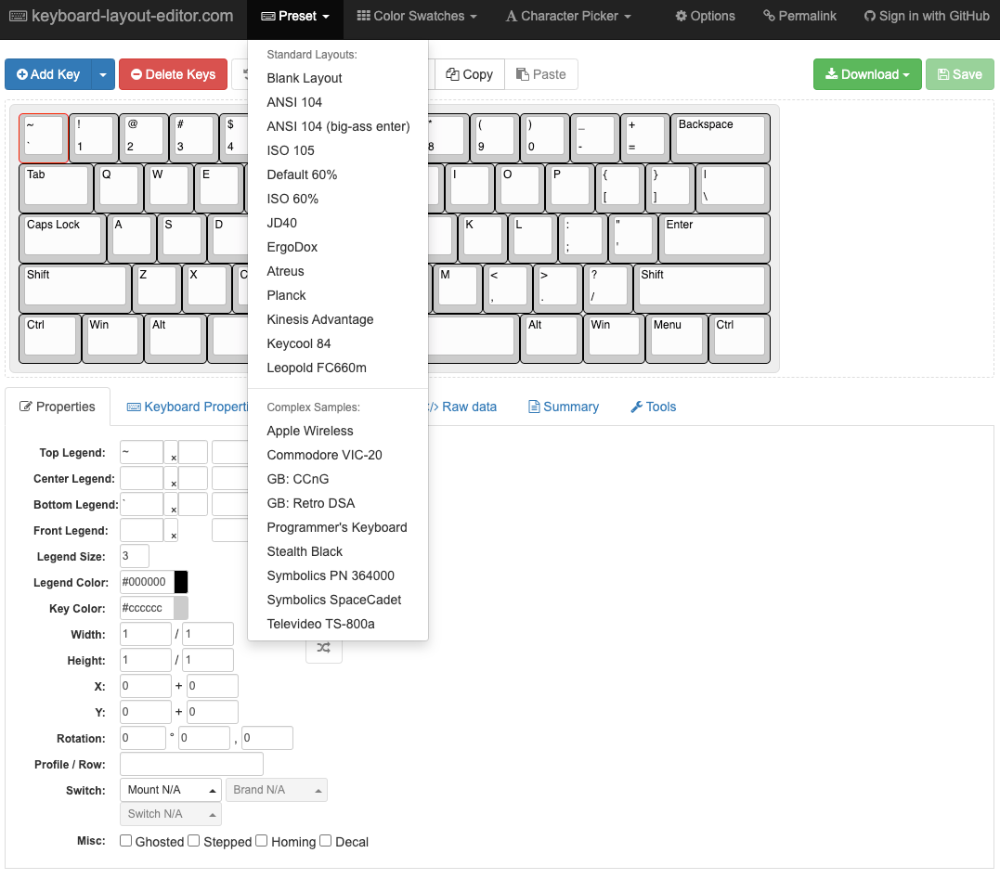
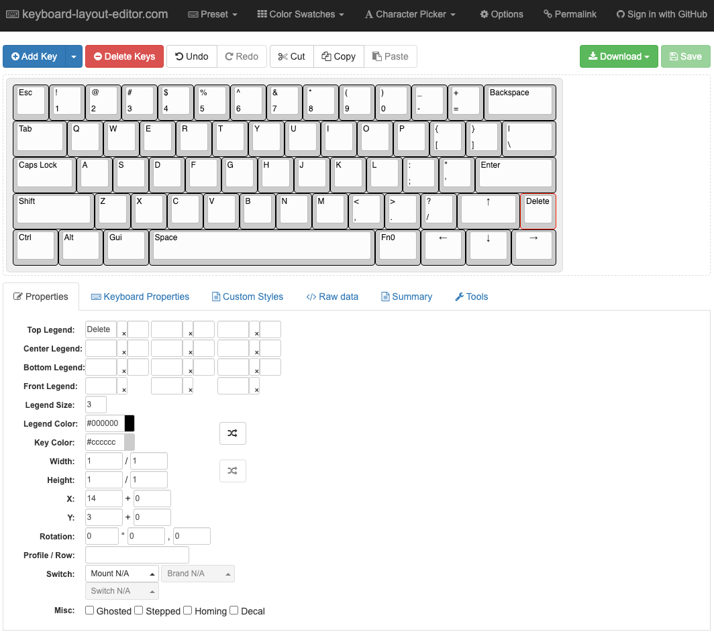

# TMK 固件 改布局及刷固件

TMK 是比较早的一种固件方案，现在直接用 TMK 方案的不太多见了。

刷 TMK 固件，简单来说需要四步：

1. 准备键盘布局及 Raw data
2. 把 Raw data 转为 eep 固件文件
3. 电脑安装工具 `tkg-toolkit`，并进行配置
4. 给键盘刷固件

## 准备键盘布局及 Raw data

打开 [Keyboard Layout Editor](http://www.keyboard-layout-editor.com/) 网站（简称 KLE）。由于 TMK
固件支持的键盘不多，大概率都是现有的老键盘（新键盘不会使用 TMK 方案），所以你的键盘应该存在默认配置。



从顶部的 `Preset` 中，选择接近你键盘的布局，我这里选择了 `Default 60%`。尽量选择接近的布局方案，这样后续修改工作量会比较少，也不太容易出错。

**本文将使用的 `标准` 层方案，非网上的 `简单` 层方案，区别在于 `标准` 方案会配置多层，生成多个 Raw data，更好理解。**

首先是左下角的修饰键，我改成了 `Ctrl` `Alt` `Gui` 。修改方法很简单，点击键盘上的按键，直接在下面的 `Top Legend` 处修改即可。

```
Propertices 中的各个模式，在标准方案下，其实没什么功能区别，仅仅是在键盘上展示位置不同。
而每一行的三个栏位，对应着做对齐、居中对齐、右对齐。
这都是仅仅为了键盘图片展示更好看而已。

Top Legend:顶部展示（正刻）
Center Legend: 中间展示（正刻）
Bottom Legend:底部展示（正刻）
Front Legend:侧面展示（侧刻）
```

```
按键调整的话，注意输入内容，它是不可以随便输入的。
比如：
  Top Legend    输入   !
  Bottom Legend 输入   3
这就不是一个合规组合。因为数字 3 对应的是 #

具体支持的按键名字，可以参考这里：https://tkg.io/#help
```

之后，我把 `右侧 Shift` 修改长度，并增加一个按键。点击 `右侧 Shift`，把下面的宽度 `width` 从 `2.75` 改成了 `1.75`
，后续可以再增加一个宽度为 `1` 的按键。

点击左上角蓝色的 `Add Key`，增加一个按键。根据我键盘的位置，我把下面的配置修改为 `X` 坐标为 `14`，`Y`
坐标为 `4`，`Top Legend` 为 `Delete`。

最后，我把左上角按键改了下，还有移除了右下角修饰键，改成了方向键。最终效果如下：



这样，我们就完成了第一层的布局。切换到 Raw data 选项卡，可以复制出来当前布局文件，注意保存好，后续要用到。以后也可以直接把之前的
Raw data 复制进去，相当于读档。

此外可以点击右上角绿色的 `Download`，选择导出键盘的图片，防止以后忘记了自己的键盘布局。

我这里的 Raw data 是：

```
["Esc","!\n1","@\n2","#\n3","$\n4","%\n5","^\n6","&\n7","*\n8","(\n9",")\n0","_\n-","+\n=",{w:2},"Backspace"],
[{w:1.5},"Tab","Q","W","E","R","T","Y","U","I","O","P","{\n[","}\n]",{w:1.5},"|\n\\"],
[{w:1.75},"Caps Lock","A","S","D","F","G","H","J","K","L",":\n;","\"\n'",{w:2.25},"Enter"],
[{w:2.25},"Shift","Z","X","C","V","B","N","M","<\n,",">\n.","?\n/",{a:5,w:1.75},"↑",{a:4},"Delete"],
[{w:1.25},"Ctrl",{w:1.25},"Alt",{w:1.25},"Gui",{w:6.25},"Space",{w:1.25},"Fn0",{a:5,w:1.25},"←",{w:1.25},"↓",{w:1.25},"→"]
```

用同样的方法，可以再制作第二层。我这里不再演示了，直接贴下我的第二层 Raw data：

```
["~\n`","F1","F2","F3","F4","F5","F6","F7","F8","F9","F10","F11","F12",{w:2},"Delete"],
[{w:1.5},"Tab",{a:7},"",{a:4},"↑",{a:7},"","","","","","","","","","",{w:1.5},""],
[{a:4,w:1.75},"Caps Lock","←","↓","→",{a:7},"","","","","","","","",{a:4,w:2.25},"Enter"],
[{w:2.25},"Shift","Fn1","Fn2","Fn3","Fn4","Fn5","VolDn","VolUp","Mute",{a:7},"","",{a:4,w:1.75},"PgUp","Ins"],
[{w:1.25},"Ctrl",{w:1.25},"Alt",{w:1.25},"Gui",{w:6.25},"Space",{w:1.25},"Fn0",{w:1.25},"Home",{w:1.25},"PgDn",{w:1.25},"End"]
```

如果需要，你可以制作更多层。

## 把 Raw data 转为 eep 文件

打开 [TMK Keymap Generator](https://tkg.io/) 网站（简称 TKG）。后面就简单一些了，因为它只有四栏配置项，其中两个还非常简单。

- **通常-键盘**，选择好你的键盘类型。
- **层**，选择标准。之后选择好键盘的层数。再根据上一步每一层的 Raw data，分别粘贴到对应层里。
- **Fn**，配置完毕**层**，就可以看到这个 Fn 配置了。你的键盘配置了多少 Fn，这里就可以看到多少个。一般 `Fn0` 就是切换到 `层1`
  ，剩下的 Fn，可以自定义。比如我把三个用作灯光控制了（后两个暂时还没用到）。
- **LED**，这个保持默认就好，我没有修改过。


配置完成后，点击页面最下面的 `下载 .eep 文件` 即可获得固件。

## 电脑安装工具 `tkg-toolkit`，并进行配置

这一步需要下载刷固件工具包，可以到 Github 进行下载。项目为 [kairyu/kg-toolkit](https://github.com/kairyu/tkg-toolkit)。

选择 `code`，之后点击 `Downdown ZIP`即可。

```
或者直接访问这个链接进行下载：
https://github.com/kairyu/tkg-toolkit/archive/refs/heads/master.zip
```

下载完成后，我们需要进行配置才可以使用。配置区分 Windows 和 MacOS，不同系统略有不同。

### Windows 下处理驱动

打开下载工具的 `Windows` 目录。运行 `tool/zadig_2.2.exe`。


点击 `Options` - `List All Device`后，或许可以看到你的键盘。如果看不到，可以点击 `Install WCID Driver` 进行安装。

如果出现什么意外，一般是驱动安装错误了。可以尝试替换驱动，分别选择 `libusb-win32 (v1.2.6.0)` `WinUSB (v6.1.7600.16385)`
之类进行尝试。


### Windows 下进行工具配置

我们要把键盘的数据先配置好。以后不更换键盘的话，就不用再配置了。

双击运行 `setup.bat`：

```
Select your keyboard:

  1. GH60 RevA/B/C
  2. GH60 RevCHN
  3. GHPad
  4. Fantastic60
  5. SMART68
  6. RedScarfII
  7. RedScarfII+
  8. LR94
  9. AKB96
 10. TentaPad
 11. Staryu
 12. Staryu Lite
 13. Kimera
 14. Kimera Core
 15. USB2USB
 16. ErgoDone
 17. CW40
 18. XD75
 19. Daisy

Please enter a number:
```

第一步，选择你的键盘型号。我的是 `GH60 RevCHN`，我选择 2，之后回车。

```
 Name:          GH60 RevCHN
 Firmware:      Default, No-Console, AVRISP mkII
 Bootloader:    atmel_dfu, lufa_dfu

Do you want to continue? [Y/n]
```

第二步，直接确认。y，回车。

```
Select a firmware for your keyboard:

 1. Default
 2. No-Console
 3. AVRISP mkII

Please enter a number: 1
```

第三步，选择固件，选择默认即可，1，回车。

```
Select bootloader of your keyboard:

 1. atmel_dfu
 2. lufa_dfu

Please enter a number: 1
```

第四步，选择键盘的 bootloader，我的是 `atmel_dfu`，我选择 1，回车。

```
Do you want to install driver for bootloader? [y/N]
```

最后一步，是否安装 bootloader，选择 n。如果选择 y，则开始给键盘刷入默认固件。

### MacOS 下处理驱动和工具配置

首先按要求安装依赖包：

```bash
brew install libusb-compat
```

之后，进入 `mac` 目录下，运行 `./setup.sh`，这一步和 Windows 下工具配置几乎一致，按要求回答就完成了配置。

## 给键盘刷固件

Windows 下和 MacOS 下基本相同，区别在于 Windows 可以拖拽选择固件，而 MacOS 需要输入命令。

Windows 下刷固件，可以简单的使用拖拽文件进行操作。我们准备好 eep 文件，拖拽到 `reflash.bat` 上就可以启动刷机工具。如果不拖拽
eep 文件，直接双击打开 `reflash.bat` 则使用默认键盘布局方案进行刷新固件。

MacOS 下刷固件，建议把固件 eep 文件放到下载工具的 `mac` 目录下，之后在 `mac` 目录下执行：

```
./reflash.sh ./keymap.eep
```

之后就基本一致了。可以看到提示：

```
Keyboard to reflash:

 Name:          GH60 RevCHN
 MCU:           atmega32u4
 Bootloader:    atmel_dfu
 Firmware:      gh60-revchn.hex

Manipulation:

 Reflash eeprom: "C:\\Users\\xxx\\keymap.eep"

Do you want to continue? [Y/n]
```

此时我们可以确认信息，没问题就直接 y，回车。

最后，需要对键盘进行 boot 操作，不同键盘不同。比如我的键盘是背后有独立的 boot 按钮（据说有的键盘是按组合键实现）。

完成后，点击任意键即可结束刷固件工具。

可以试试你的新键盘固件了。
