# 键盘的分类介绍

## 键盘的分类

一般来说，常见的分类方式是按照按键触发方式区分的，故把键盘分成三类：薄膜键盘、机械键盘、静电容键盘。

### 薄膜键盘

薄膜键盘比较常见，就是最常规的一种键盘，如果你拆开过它，可以看到里面有导电橡胶，下面有薄膜。

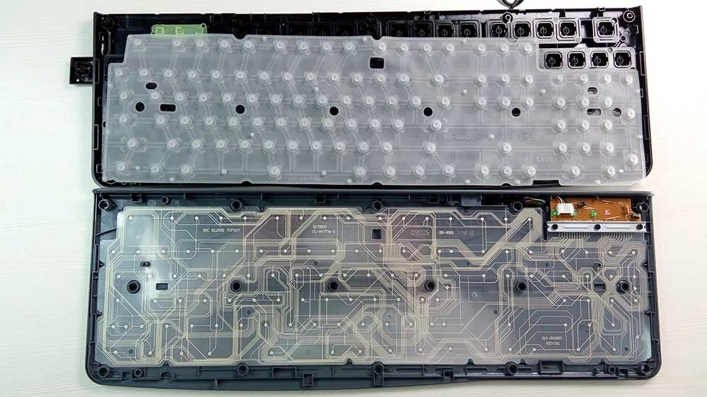

图源：https://zhuanlan.zhihu.com/p/19953400

薄膜键盘好处是成本低，可以做的轻薄，也比较轻便，噪音比较小。缺点是手感一般。

价格上，从几十元到上百元不等，基本上五百多元就是天花板了。

键盘布局上，基本上都是标准的 104 标准布局。

常见的品牌有罗技、双飞燕等。

### 机械键盘

比较主流的高端键盘。程序员届几乎人手一把。本系列文章后续也都集中在机械键盘方向上。


图源：[Keychron Q5 官网](https://www.keychron.com/products/keychron-q5-qmk-custom-mechanical-keyboard)

价格上常见于从二三百元到一两千元。入门大概不到三四百元，中端一般不超过六七百元。

至于高端的，那就没上限了。有常规千元的，也有将近两千的。还有极个别好几千的。

比如怒喵键盘，几乎全网无货，五千到六千起步。不过怒喵这类，也可以算作另一个方向，那就是机械键盘客制化。

```
客制化就是定制化的意思，据说是来自港台地区。键盘圈都叫做客制化。
```

这些年，客制化也分很多种，比如买到的零售键盘，你自己更换键轴（轴体）、键帽、甚至修改键盘固件、键位等。

早些年的话，客制化都是指自己做一把独一无二的键盘。比如我 2016 年购买了成品电路板、外壳、键轴、键帽等，自己焊接了一个键盘，最后又给它刷了固件。

机械键盘好处是手感不错，可以定制或者有不少可玩性（看你愿意花费多少），缺点是一般都比较重（如果是铝坨坨那么一把键盘好几斤都非常正常），还比较贵。

```
铝坨坨就是铝壳键盘，特别的重。
```

### 静电容键盘

它的轴体不是机械结构，是电容容量变化触发。

这个类别的键盘比较小众，我只见过有人用 HHKB。曾经听说过 PLUM（普拉姆），好像还有一个 realforce。

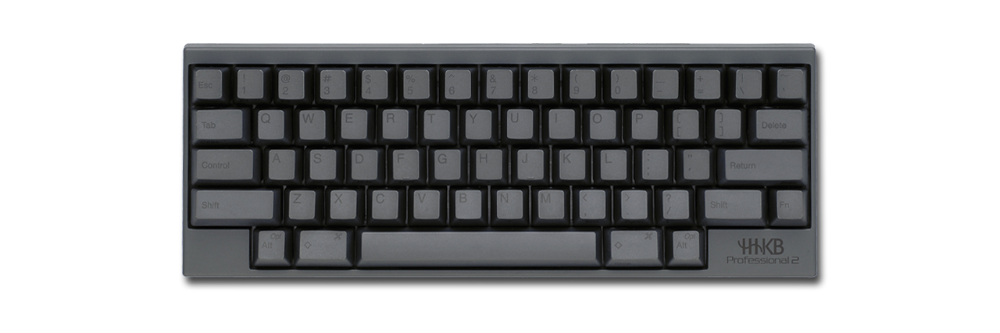

图源：[Happy Hacking Keyboard 官网](https://happyhackingkb.com/)

由于我也没用过，所以不好评价。

它好处是比较静音，缺点是价格普遍都比较高。比如 HHKB，一千起步，最贵的要两千多。

程序员生涯工作超过 10 年，就见过一个程序员用的 HHKB，大概就是这么小众。

## 键盘的尺寸

键盘从大到小，有 100%、96%、80%、75%、60%、40% 等。这个是指相对于一个完整的全 104 键盘，它大概按键数量占比。这个大小一般指明了布局方案，并不指代键盘的实际尺寸大小。比如
A 厂商 96% 键盘和 B 厂商 96% 键盘外壳、保护罩不一定能通用。

还有直接称作键盘大概按键数量的。一般有多少个按键，就算是多少的配列。比如 104 配列，那么主要功能按键就是 104 个。

```
这个不用严格的去数，很多时候按键数对应不上。
比如 98 配列键盘，可能会有 100 个按键。
就像 Keychron 部分键盘区分按键版和旋钮版，旋钮版一般就和按键板存在出入，并不是单纯把按钮换成旋钮而已。但他们比较接近，且外壳尺寸相同，都算同一个配列。
据说 96% 键盘最早有 96 个按键，但是其他厂商为了不触犯专利，故意增加几个按键，这样就出现了 98 配列等。
```

### 100% 系列

最常规的，就是 100% 全尺寸键盘。常见有 104 配列和 108 配列。108 就是比 104 在右上角多了 4 个功能键。

按键最多的，也是最方便的。就是尺寸最大，不方便携带。

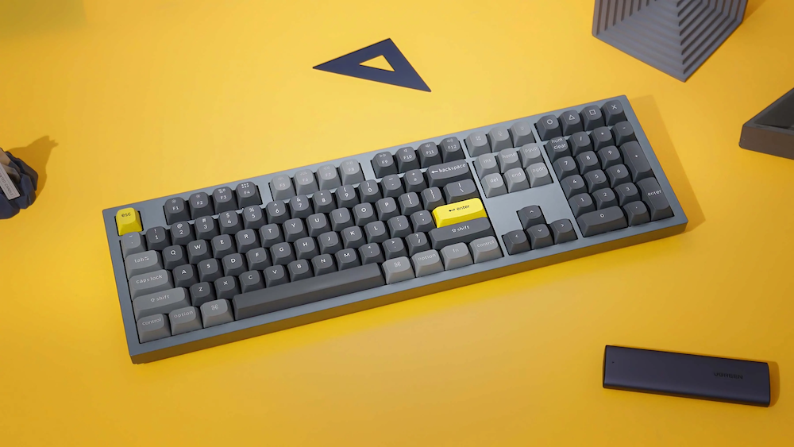

图源：[Keychron Q6 官网](https://www.keychron.com/products/keychron-q6-qmk-custom-mechanical-keyboard)，108配列。

### 96% 系列

常见有 96/98 配列。主要是在 100% 全尺寸基础上，把光标导航区域精简了，转移到小键盘区上侧。还有就是右侧 `Ctrl`
等按键变小了，移除了不常用的 `App` 键。

96 配列更加激进，把键盘区域间的距离都省掉了。这个不太推荐，经常误触。

一般习惯上，把有间距的键盘称作 98 配列，没有间距的称作 96 配列。

```
再次提醒下，这个配列不要数按键个数，因为大概率不是 96/98 个。
```


图源：[Keychron Q5 官网](https://www.keychron.com/products/keychron-q5-qmk-custom-mechanical-keyboard)，98配列。

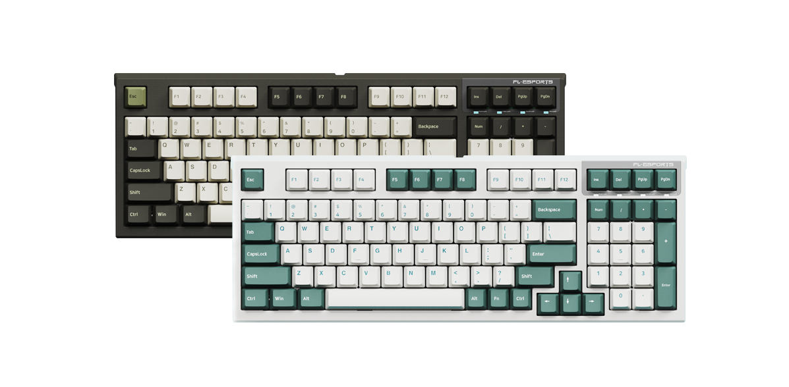

图源：[腹灵 FL980 官网](http://flesports.com/product/keyboard/view-2939.html)，98 配列。

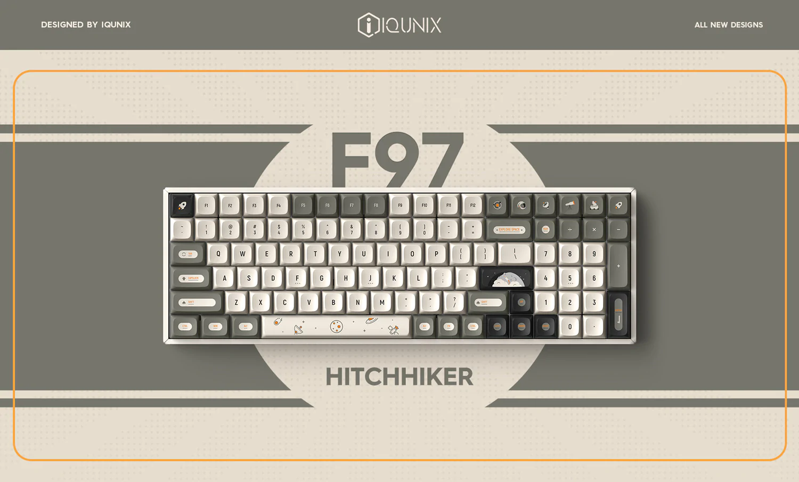

图源：[IQUNIX F97 官网](https://iqunix.store/collections/hitchhiker-series/products/f97-hitchhiker)，96 配列。

### 80% 系列

最常见的就是 87 配列。一般也叫做 TKL（Tenkey less）。和全键盘相比，主要就是精简掉小键盘区域了。如果你不需要小键盘输入数字，那么
87 配列非常合适。


图源：[Keychron Q3 官网](https://www.keychron.com/products/keychron-q3-qmk-custom-mechanical-keyboard)

### 75% 系列

从这个系列开始，按键越来越少，就没什么规律了，个大厂商按键数差别都比较大。也是从这个系列开始，基本都比较小巧，可以考虑携带。

这个系列最主要的特点就是，有 `F1` 等功能区，有上下左右，有少量光标导航按键。

可以计算下：常规 `esc`、`F1` ～ `F12`、键盘数字键、字母键、主键盘常规控制键，就已经 77 个了。

```
要注意的是，虽然按键很多时候都超过 80 个，但是它不算 80% 系列。
```

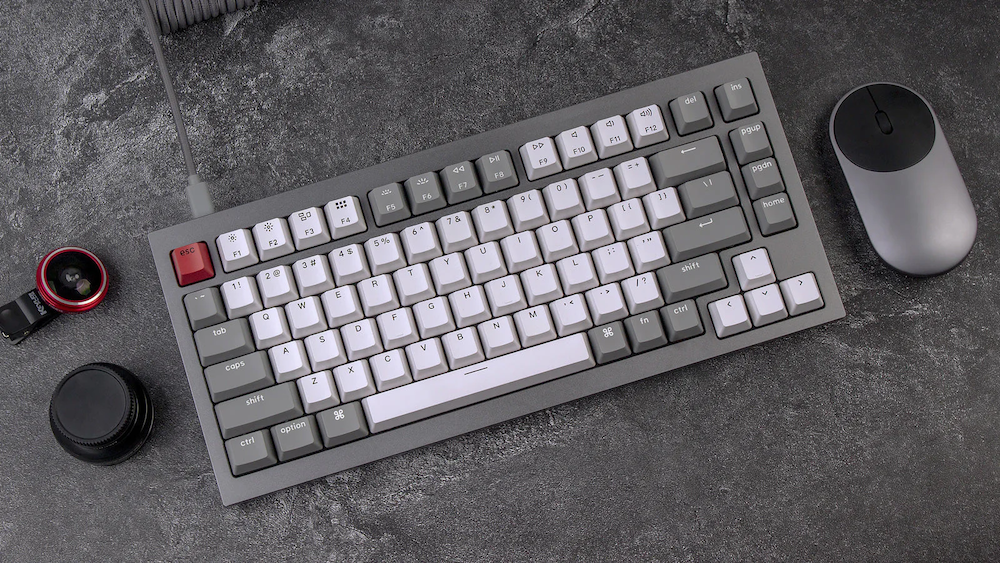

图源：[Keychron Q1 官网](https://www.keychron.com/products/keychron-q1-qmk-custom-mechanical-keyboard)，82 键。77 键外加 5
个控制键。

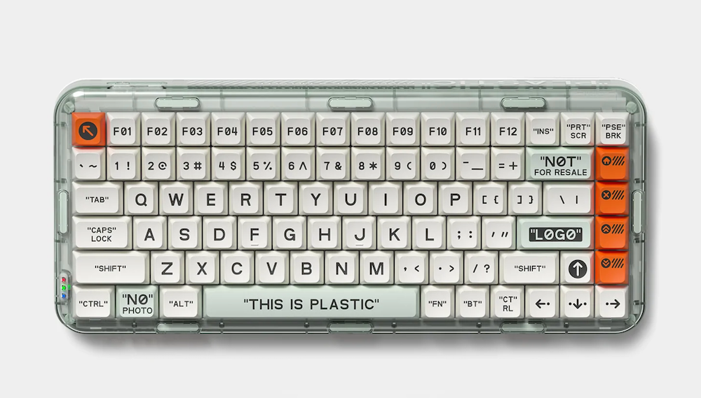

图源：[MelGeek MOJO 84 官网](https://www.melgeek.com/products/melgeek-mojo84-plastic-original-see-through-custom-programmable-mechanical-keyboard)
，84 键。77 键外加 7 个控制键。

### 60% 系列

这个系列也比较混乱。最主要的特征就是在 75% 系列上，精简掉了 `F1` 这一行功能键。而且常规 64
键以下，大概率是没有方向键的，需要使用 `FN` 组合触发。不过 65 键以上，一般是带有的。至于光标导航键，基本上极少。

这也是算是一般正常能用的最小键盘了。很多品牌都有不少经典款式。

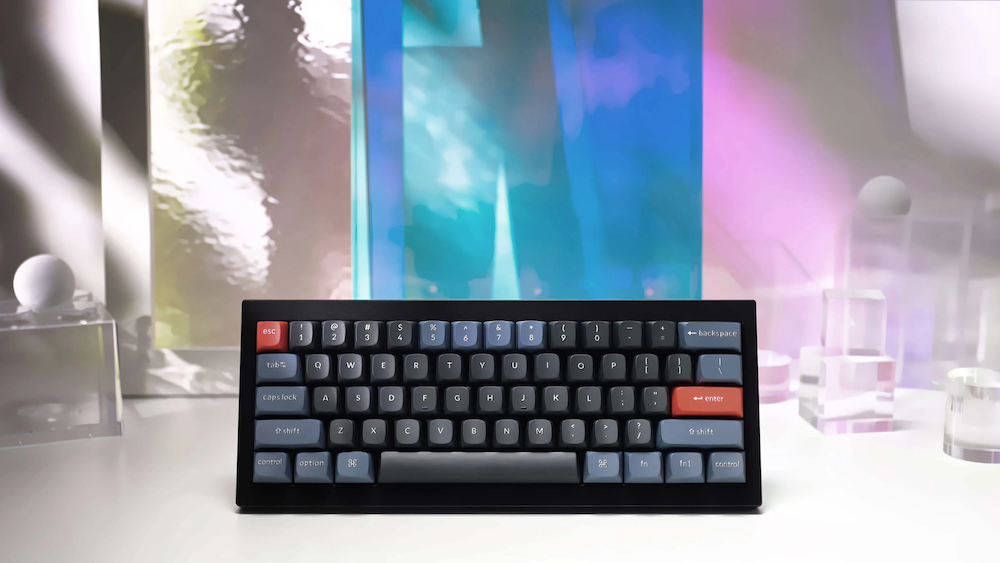

图源：[Keychron Q4 官网](https://www.keychron.com/products/keychron-q4-qmk-via-custom-mechanical-keyboard)，61 键。

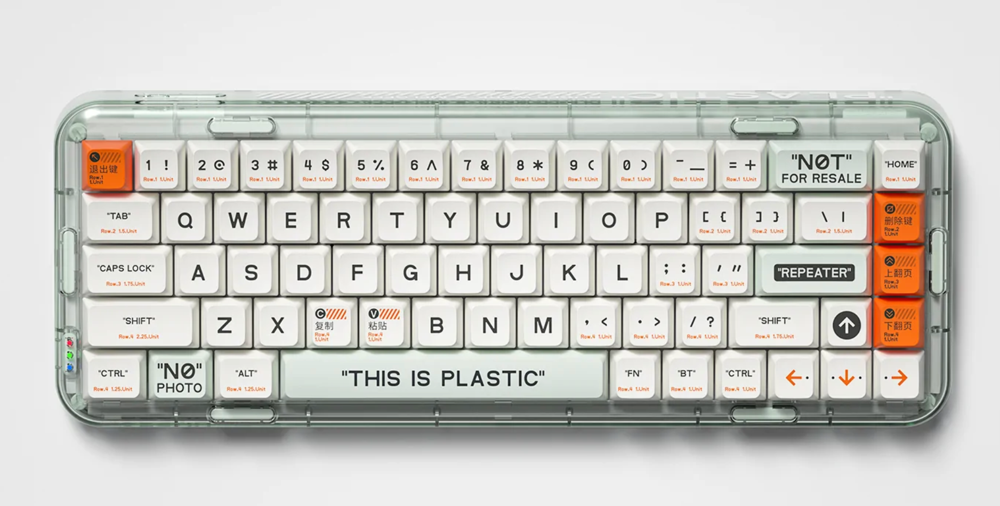

图源：[MegGeek MOJO68 官网](https://www.melgeek.com/products/melgeek-mojo68-plastic-see-through-custom-programmable-mechanical-keyboard)
，68 键。

### 40% 系列

这个系列并不多见，主要就是在 60% 系列上，把数字那一行再去掉。我觉得没办法安心使用。

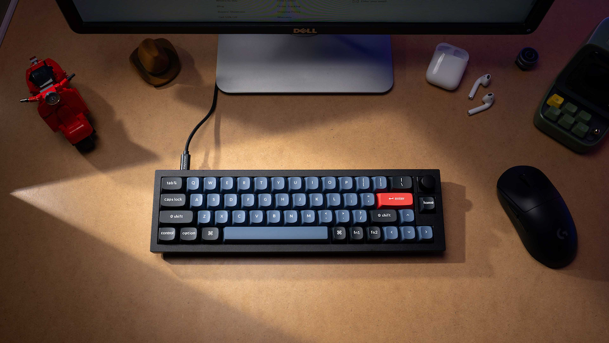

图源：[Keychron Q9 官网](https://www.keychron.com/products/keychron-q9-qmk-custom-mechanical-keyboard)，52键（含旋钮）。

40 个按键是什么水准呢？标准 26 个字母，加上 10
个基本符号键，加上 `enter` `tab` `caps lock` `shift` `ctrl` `alt` `space` `backspace` `esc`，外加 2 个 `FN`，就已经是 47
个键了。此外，40% 键盘一般会精简基本的符号键，或者只有一个 `FN` 键。

## 键盘尺寸总结一下

如果桌面空间够用，而且对按键效率高，直接选择 100% 系列最合适。

希望稍微小一点的，而且可以接受键位调整的，96% 也是不错的选择。这里面建议选择 98 配列的，96 配列无间隔的键盘过于紧凑，会比较难适应。

希望在小一点的，对数字键盘没有需求的，可以考虑 80% 系列，或者 75% 系列。两者基本上是光标导航区域位置和多少的区别。75%
系列更容易携带。

如果比较极客，或者对便携性要求高，可以考虑 60%，但是这个系列缺少 `F1` ～`F12` 的按键，需要考虑好。

| 系列        | 主键盘数字键 | Fn 功能键（F1等） | 光标控制（上下左右） | 光标导航（Home PageUp等） | 小键盘 |
|-----------|--------|-------------|------------|--------------------|-----|
| 100%      | ✅      | ✅           | ✅          | ✅                  | ✅   |
| 96%       | ✅      | ✅           | ✅          | 精简及位置转移            | ✅   |
| 80%（87配列） | ✅      | ✅           | ✅          | ✅                  | ❌   |
| 75%       | ✅      | ✅           | ✅          | 精简及位置转移            | ❌   |
| 60%       | ✅      | ❌           | 部分键盘存在     | 极其精简或没有            | ❌   |
| 40%       | ❌      | ❌           | 大概率无       | ❌                  | ❌   |

## 其他键盘方案

还有 Alice 方案，简单说就是两手分开的键盘（分体键盘）。有 100% 的，还有 75%、60% 的。这个系列常见于客制化。

有的是一块键盘分两边，也有干脆就是两块键盘（中间可能用线连接，也可能是蓝牙连接）。

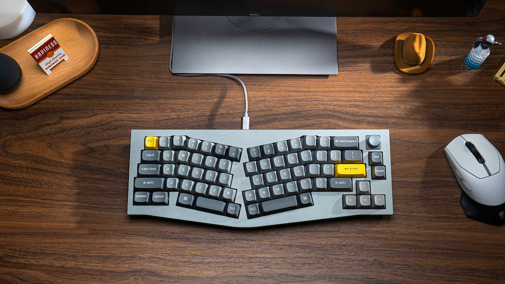

图源：[Keychron Q8 Alice 官网](https://www.keychron.com/products/keychron-q8-alice-layout-qmk-custom-mechanical-keyboard)
，60% 系列。

还有单独小键盘。最基础的就是 4x5 的小键盘，也有上面增加一行按钮的，变成了 4x6。还有少见的，增加左侧一列宏功能的。

独立小键盘一般常见于辅助 87% 75% 60% 键盘。

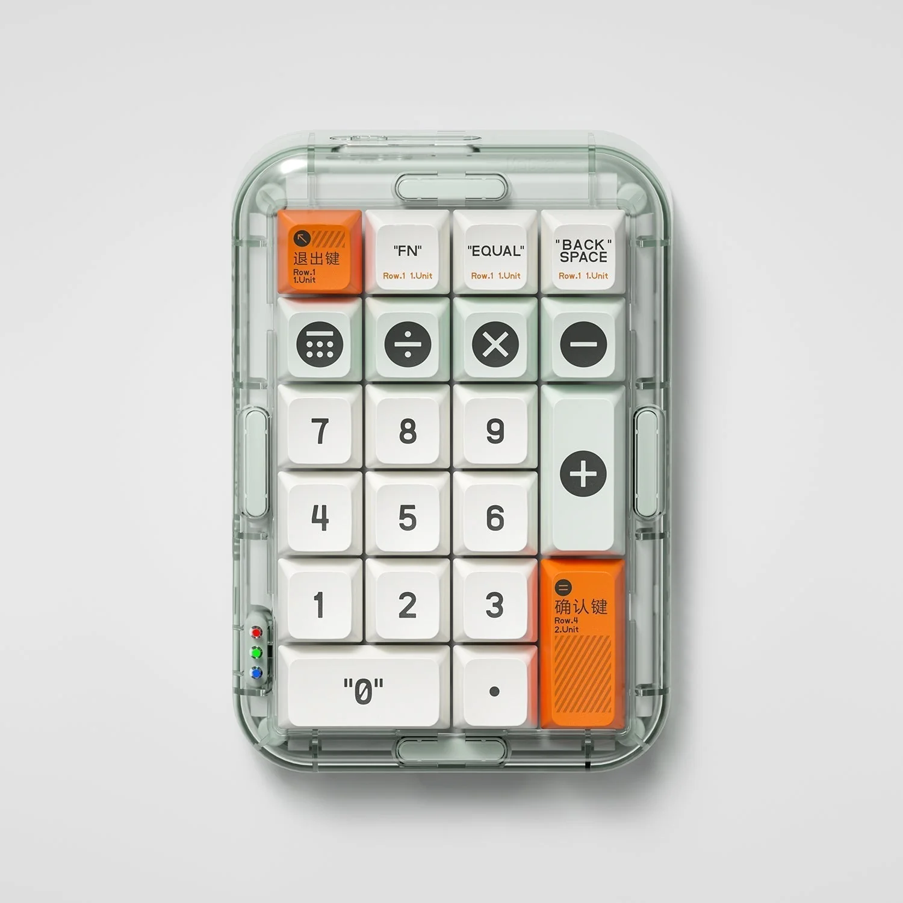

图源：[MelGeek MOJO Pad 官网](https://www.melgeek.com/products/melgeek-mojopad-plastic-numpad-mechanical-keyboard-melgeek-com)

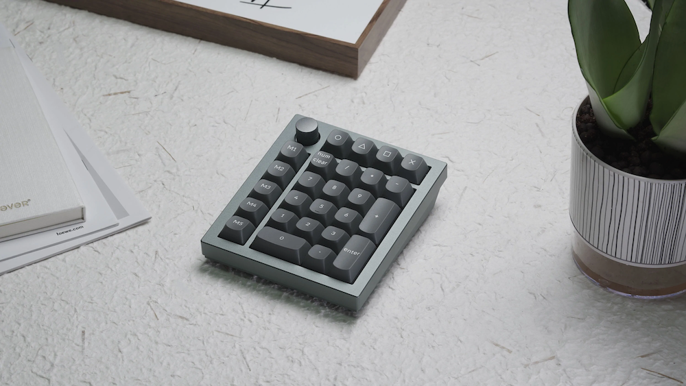

图源：[Keychron Q0 PLUS 官网](https://www.keychron.com/products/keychron-q0-plus-qmk-custom-number-pad)

## 还有一些细节

### 键线分离

曾经大部分量产键盘，都是键盘和数据线一体的。不过随着蓝牙、Wi-Fi 2.4G
无线的普及，基本上绝大部分键盘都已经做到了键盘和数据线分开了，这种叫做键线分离。如果是具备无线，那么键盘一定不会带有长在键盘上的数据线，一定是可以插拔的。除非是特别低端键盘或者是老款键盘，才会存在这种情况。

### 轴体热插拔

有的键盘键轴下面不是直接焊接在 PCB 主板上，在主板上有热插拔底座，此时键盘可以随时用拔轴器（不是拔键器）来更换轴体。如果不是热插拔，也不是不能更换轴体，就是轴体焊接在主板上，需要电烙铁焊接下来，再更换轴体。

### 背光和灯效

有的键盘带有单色灯光，有的则是 RGB 多色可变灯光。凡事带灯的键盘，基本上都要接入有线，无线连接再开启灯光比较费电，一般撑不了多久（两天～一周）。

### 连接方式

Wi-Fi 2.4G 和蓝牙连接，会有些许延迟。据说玩游戏还是能感觉到。也有人推荐罗技优联方案，延迟会小很多。我没怎么用过无线键盘，不多做评价了。

### 小屏幕

个别个性键盘，会带有一小块屏幕。就目前的场景来说，基本上都没什么用处。常见于显示无线键盘的电量、键盘指示灯或蓝牙类连接状态、图案、一句话等。大屏幕的话，好像只有怒喵一家，虽然是屏幕大，但本质分辨率不高，使用场景同前。我个人猜测，目前键盘使用的主控性能孱弱，不足以支撑大屏高分辨率。未来可能会出现高性能键盘，键盘主控本质就是个独立电脑，届时屏幕才能做大做强，那时候才有意义。不过这样键盘供电也是问题，需要放入更大容量电池。用接近铝坨坨的重量，实现一把塑料壳键盘。或者只能做到有线连接。

### 键盘按键自定义

一般在高端键盘上会出现按键自定义功能。有的是厂商提供制定的工具来实现（内部实现可能也是来源于开源方案），也有直接使用开源方案来实现的（QMK
VIA 等）。这个功能看个人需求，改键的好处就是让键盘更适应自己，或者对键盘增加扩展能力。比如我的键盘改键之后支持 `F13`～ `F24`
，电脑端有插件来实现不同的功能。还有就是可以编辑宏功能，对一些常用文本实现一键输入。

## 键盘的客制化

一般来讲，都是针对机械键盘的客制化。比如更换轴体、键帽等。

但也不是说薄膜键盘不能改，我就见过有的人手工抄电路，把薄膜键盘更换主控芯片刷固件的，但太小众了。

还有就是静电容键盘，有的品牌键帽和机械键盘相同，都是十字键帽，可以更换。不过这个建议提前研究好，静电容键盘很多不是常规键帽。

机械键盘也不完全都是常规的轴体，我曾见过为了透光，键轴不是十字而是空心口字的，这种也没办法更换常规键帽。

更高阶的，就是自组键盘。自组键盘常见的都是 60% 系列，也有 75%、80% 系列的，但是相对不多。

常见自组键盘，主要是购买电路板、外壳、键轴、键帽等，自己组装，自己刷写固件。也有一些高手，自己绘制电路板，自己配置主控，基本从零构建自己想要的键盘。
